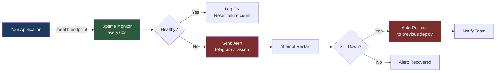
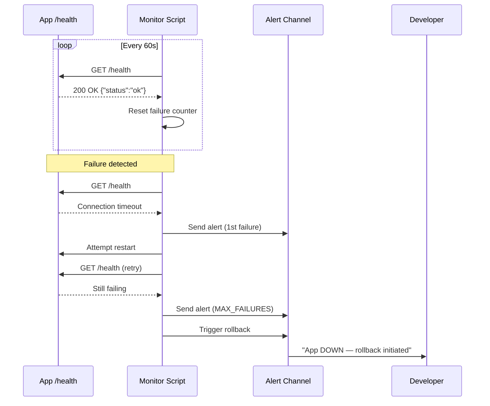
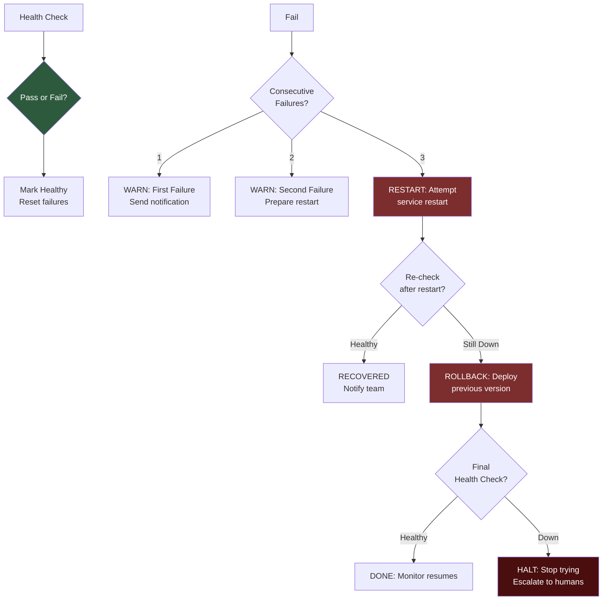

# Post-Deploy — Monitor, Alert, Recover

Post-deployment monitoring, alerting, rollback, and health checks — detect failures instantly and recover before users notice.

---

## Table of Contents

1. [Problem Statement](#1-problem-statement)
2. [Solution Overview](#2-solution-overview)
3. [Architecture](#3-architecture)
4. [Quick Start](#4-quick-start)
5. [Health Check Script](#5-health-check-script)
6. [Alerting Setup](#6-alerting-setup)
7. [Automatic Rollback](#7-automatic-rollback)
8. [Uptime Dashboard](#8-uptime-dashboard)
9. [Resource Monitoring](#9-resource-monitoring)
10. [Log Aggregation](#10-log-aggregation)
11. [Common Pitfalls](#11-common-pitfalls)
12. [FAQ](#12-faq)
13. [Contributing & Support](#13-contributing--support)

---

## 1. Problem Statement

You deployed your app. Three hours later, a user messages you: "site is down." You had no idea. There is no monitoring, no alerts, no automatic recovery. Every outage is discovered by users, not by your infrastructure. Rolling back requires SSH, git reflog, and praying.

## 2. Solution Overview

A layered monitoring and recovery system:

- **Health checks** every 60 seconds against your app's `/health` endpoint
- **Instant alerts** to Telegram, Discord, or Slack when things break
- **Automatic rollback** if restarts don't fix the issue
- **Uptime dashboard** showing real-time status
- **Resource monitoring** for CPU, RAM, and disk thresholds
- **Log aggregation** for post-mortem analysis

## 3. Architecture



### Alert Flow



### Recovery Decision Tree



## 4. Quick Start

```bash
# 1. Clone this repo
git clone https://github.com/nerudek/post-deploy.git
cd post-deploy

# 2. Create a health endpoint in your app (see section 5)

# 3. Run the health checker
HEALTH_URL="https://your-app.com/health" \
TELEGRAM_BOT_TOKEN="your:token" \
TELEGRAM_CHAT_ID="your-chat-id" \
python3 health-check.py

# 4. Set it and forget it (cron / systemd / launchd)
```

## 5. Health Check Script

```python
#!/usr/bin/env python3
"""health-check.py - ping your app, alert on failure, attempt recovery"""
import urllib.request, json, time, os, subprocess

TARGET = os.getenv("HEALTH_URL", "https://your-app.com/health")
TELEGRAM_BOT = os.getenv("TELEGRAM_BOT_TOKEN")
TELEGRAM_CHAT = os.getenv("TELEGRAM_CHAT_ID")
MAX_FAILURES = 3
CHECK_INTERVAL = 60

def alert(msg):
    if TELEGRAM_BOT and TELEGRAM_CHAT:
        urllib.request.urlopen(f"https://api.telegram.org/bot{TELEGRAM_BOT}/sendMessage",
            data=urllib.parse.urlencode({"chat_id": TELEGRAM_CHAT, "text": msg}).encode())
    print(f"[ALERT] {msg}")

failures = 0
while True:
    try:
        r = urllib.request.urlopen(TARGET, timeout=10)
        if r.status == 200 and '"status":"ok"' in r.read().decode():
            if failures > 0:
                alert(f"RECOVERED - app healthy after {failures} failures")
            failures = 0
            print(f"[OK] {time.strftime('%H:%M:%S')}")
        else:
            failures += 1
            print(f"[WARN] Bad response: {r.status}")
    except Exception as e:
        failures += 1
        print(f"[FAIL] {e} ({failures}/{MAX_FAILURES})")

    if failures == 1:
        alert(f"FIRST FAILURE - {TARGET}")
    elif failures == MAX_FAILURES:
        alert(f"RESTARTING after {MAX_FAILURES} failures")
    elif failures == MAX_FAILURES + 2:
        alert(f"ROLLING BACK - restart did not help")

    time.sleep(CHECK_INTERVAL)
```

### Expected health endpoint response

Your app's `/health` endpoint should return:

```json
{"status": "ok"}
```

A more thorough health check can verify database connectivity, Redis ping, and disk space:

```python
# Example FastAPI health endpoint
@app.get("/health")
async def health():
    try:
        db.execute("SELECT 1")
        redis.ping()
        return {"status": "ok", "db": "connected", "redis": "connected"}
    except Exception as e:
        return {"status": "degraded", "error": str(e)}, 503
```

## 6. Alerting Setup

### Telegram

```bash
# 1. Create a bot with @BotFather on Telegram
# 2. Get your bot token
# 3. Find your chat ID:
curl https://api.telegram.org/bot<TOKEN>/getUpdates

# 4. Send a test alert
curl -s -X POST "https://api.telegram.org/bot<TOKEN>/sendMessage" \
  -d "chat_id=<CHAT_ID>" \
  -d "text=ALERT: App is DOWN at $(date)"
```

### Discord Webhook

```bash
curl -X POST "$DISCORD_WEBHOOK" \
  -H "Content-Type: application/json" \
  -d '{"content": "ALERT: App is DOWN at '"$(date)"'"}'
```

### Slack Webhook

```bash
curl -X POST "$SLACK_WEBHOOK" \
  -H "Content-Type: application/json" \
  -d '{"text": "ALERT: App is DOWN at '"$(date)"'"}'
```

## 7. Automatic Rollback

| Platform | Command |
|----------|---------|
| Railway | `railway rollback` |
| Fly.io | `fly deploy --image registry.fly.io/app:previous` |
| VPS (Docker) | `ssh vps "cd /app && git checkout HEAD~1 && docker compose up -d --build"` |
| Vercel | Dashboard: Promote previous deploy to Production |
| K8s | `kubectl rollout undo deployment/app` |
| Heroku | `heroku rollback` |

### Rollback safety checks

1. Always attempt **restart first** — rollback is a last resort
2. Set a **max restart count** (default: 3 attempts)
3. After rollback, run **one final health check**
4. If rollback also fails, **stop and escalate to humans**
5. Log every rollback event with timestamps for post-mortem

## 8. Uptime Dashboard

```html
<!-- status.html -->
<!DOCTYPE html>
<html><head><meta charset="UTF-8"><title>Status</title>
<style>body{background:#111;color:#fff;font:system-ui;display:flex;justify-content:center;align-items:center;height:100vh}
.up{color:#22c55e}.down{color:#ef4444}.checking{color:#facc15}</style></head>
<body>
<div><h1 class="checking" id="status">CHECKING...</h1>
<p id="detail"></p></div>
<script>
fetch('https://your-app.com/health').then(r=>r.json()).then(d=>{
  const up = d.status==='ok';
  document.getElementById('status').textContent = up?'UP':'DOWN';
  document.getElementById('status').className = up?'up':'down';
  document.getElementById('detail').textContent = up?'All systems operational':d.error||'Service degraded';
}).catch(()=>{
  document.getElementById('status').textContent='DOWN';
  document.getElementById('status').className='down';
  document.getElementById('detail').textContent='Cannot reach server';
});
</script></body></html>
```

Host on Vercel, Netlify, or GitHub Pages for a free status page.

### Uptime Service Comparison

| Service | Free Tier | Check Interval | Best For |
|---------|-----------|----------------|----------|
| Uptime Robot | 50 monitors | 5 minutes | Simple HTTP monitoring |
| Better Uptime | 10 monitors | 3 minutes | Status page included |
| Pulsetic | 10 monitors | 1 minute | Modern UI, Slack alerts |
| Self-hosted (this script) | Unlimited | 60 seconds | Full control |

## 9. Resource Monitoring

```bash
#!/bin/bash
# resource-check.sh - monitor CPU, RAM, and disk on remote server

VPS="${1:-user@your-server.com}"
THRESHOLD=80
TOKEN="${TELEGRAM_BOT_TOKEN}"
CHAT_ID="${TELEGRAM_CHAT_ID}"

# Memory usage
MEM_USAGE=$(ssh "$VPS" "free | awk '/Mem/{printf \"%.0f\", \$3/\$2*100}'")
if [ "$MEM_USAGE" -gt "$THRESHOLD" ]; then
  curl -s "https://api.telegram.org/bot$TOKEN/sendMessage" \
    -d "chat_id=$CHAT_ID" \
    -d "text=RAM: ${MEM_USAGE}% use on $VPS (threshold: ${THRESHOLD}%)"
fi

# Disk usage
DISK_USAGE=$(ssh "$VPS" "df / | awk 'NR==2{print \$5}' | tr -d '%'")
if [ "$DISK_USAGE" -gt "$THRESHOLD" ]; then
  curl -s "https://api.telegram.org/bot$TOKEN/sendMessage" \
    -d "chat_id=$CHAT_ID" \
    -d "text=DISK: ${DISK_USAGE}% use on $VPS (threshold: ${THRESHOLD}%)"
fi

# CPU load (1-minute average)
CPU_LOAD=$(ssh "$VPS" "cat /proc/loadavg | awk '{print \$1}'")
CPU_CORES=$(ssh "$VPS" "nproc")
CPU_PERCENT=$(echo "$CPU_LOAD $CPU_CORES" | awk '{printf \"%.0f\", \$1/\$2*100}')
if [ "$CPU_PERCENT" -gt "$THRESHOLD" ]; then
  curl -s "https://api.telegram.org/bot$TOKEN/sendMessage" \
    -d "chat_id=$CHAT_ID" \
    -d "text=CPU: ${CPU_PERCENT}% load on $VPS (threshold: ${THRESHOLD}%)"
fi
```

## 10. Log Aggregation

```bash
# Stream logs from remote server to local file
ssh $VPS "docker compose logs -f --tail=100" > logs/app-$(date +%Y%m%d).log &

# Search across all logs
grep -rn "ERROR\|FATAL\|CRASH" logs/

# Rotate daily
0 0 * * * mv logs/app-$(date -d yesterday +%Y%m%d).log logs/archive/
```

### Dead Man's Switch

Use [Healthchecks.io](https://healthchecks.io) (free) as a dead man's switch for your monitoring script itself:

```bash
# Add to your health check cron
curl -fsS -m 10 --retry 5 -o /dev/null \
  "https://hc-ping.com/YOUR-UUID"
```

If the monitoring script crashes, Healthchecks.io alerts you — preventing a silent failure of your monitoring system.

## 11. Common Pitfalls

1. **Health check always returns 200** — check actual functionality, not just HTTP status. Verify DB connectivity, Redis ping, and disk space inside the endpoint.
2. **No dead man's switch** — if the monitoring script crashes, you lose coverage. Use Healthchecks.io as a heartbeat.
3. **Alert fatigue** — only alert on actionable issues. Transient errors (1-2 failures) are warnings, not alerts.
4. **Restart loop** — after 3 failed restarts, STOP and alert. Don't let the system thrash.
5. **Health check URL exposed** — use a cacheable path behind CDN or protect with a simple token.
6. **No deploy grace period** — health checks resume immediately after deploy, causing false positives. Add a 60-second grace window.
7. **Only monitoring HTTP** — check SSL expiry, cron jobs, background workers, and queue depth too.

## 12. FAQ

**Q: How fast should health checks be?**
60 seconds for most apps. 30 seconds for critical APIs. 5 minutes for hobby projects.

**Q: What should the health endpoint check?**
Process alive (minimum). Database connectivity, Redis ping, disk space (better). Lightweight integration test (best).

**Q: Can I monitor multiple apps from one script?**
Yes — loop over a list of URLs, track failures per-app, alert per-app.

**Q: How do I know if the monitoring itself is down?**
Use Healthchecks.io as a dead man's switch — your monitoring script pings it every cycle. If the ping stops, you're alerted.

**Q: What about SSL certificate expiry?**
Uptime Robot monitors SSL. Or: `echo | openssl s_client -connect domain:443 2>/dev/null | openssl x509 -noout -dates`

**Q: How to handle planned maintenance?**
Toggle maintenance mode, silence alerts for 5 minutes, deploy, health check, resume alerts.

**Q: Can I monitor internal services?**
Use Tailscale IP (100.x.x.x) in health check from another Tailscale-connected machine.

**Q: What about performance monitoring?**
Track `/health` latency, alert if >2 seconds. Use `time curl` or `time.monotonic()` in script.

**Q: Simplest alerting for a solo developer?**
Telegram bot + health check script. 20 lines of Python. Zero cost. Instant phone notifications.

**Q: Transient failures vs real outages?**
Count consecutive failures. 1-2 = warn (transient). 3+ = alert (real outage). Reset counter on success.

**Q: Auto-restart or auto-rollback?**
Auto-restart first. Rollback if restart fails within 2 minutes. Human review for anything beyond that.

**Q: Can I monitor cron jobs?**
Yes — use Healthchecks.io or a heartbeat URL that the cron pings on completion. If the ping stops, the cron failed.

**Q: How to set up a status page?**
Better Uptime (free status page included). Or host the `status.html` above on Vercel (free tier).

**Q: What metric matters most?**
Uptime percentage. Aim for 99.5%+ (= max 3.6 hours downtime/month). Track with a simple counter.

**Q: How to avoid false positives during deploy?**
Add a 60-second grace period after deploy before health checks resume alerting. Have the deploy script silence alerts temporarily.

**Q: What about background workers and queues?**
Monitor queue depth, worker process count, and job failure rate. Add dedicated health endpoints for workers.

**Q: How to handle database connection pool exhaustion?**
Track active connections in the health endpoint. Alert when pool usage exceeds 80%.

## 13. Contributing & Support

Contributions are welcome! Open an issue or pull request on [GitHub](https://github.com/nerudek/post-deploy).

---

If this saved you time: [PayPal.me/nerudek](https://www.paypal.me/nerudek)  
GitHub: [github.com/nerudek](https://github.com/nerudek)
